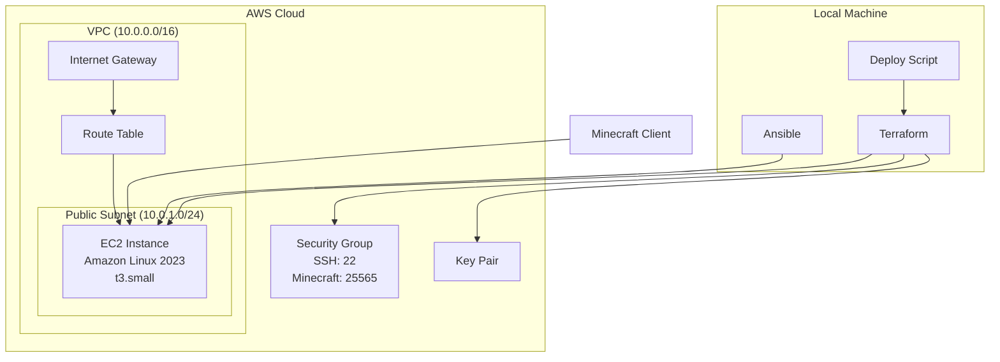
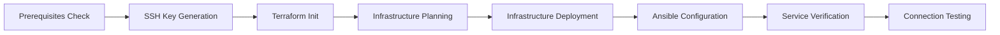

# Automated Minecraft Server Deployment on AWS

This project provides a complete Infrastructure as Code (IaC) solution for deploying a Minecraft server on Amazon Web Services (AWS) using Terraform for infrastructure provisioning and Ansible for configuration management.

## Background

### What Will We Do?
This project automates the deployment of a production-ready Minecraft server on AWS infrastructure. The solution includes:

- **Infrastructure Provisioning**: Complete AWS infrastructure setup including VPC, subnets, security groups, and EC2 instances
- **Server Configuration**: Automated installation and configuration of Java, Minecraft server, and system services  
- **Service Management**: Proper systemd service configuration with automatic startup, graceful shutdown, and restart capabilities
- **Monitoring**: Basic logging and health checks

### How Will We Do It?
The deployment uses a two-stage approach:

1. **Infrastructure Stage** (Terraform): Creates and manages AWS resources
2. **Configuration Stage** (Ansible): Configures the server software and services

The entire process is orchestrated through deployment scripts that handle the complete workflow from infrastructure creation to service verification.

## Architecture Overview



## Requirements

### Prerequisites
Before running the deployment pipeline, ensure you have the following tools installed and configured:

#### Required Tools
- **Terraform** (>= 1.2.0) - [Installation Guide](https://learn.hashicorp.com/tutorials/terraform/install-cli)
- **Ansible** (>= 2.9) - [Installation Guide](https://docs.ansible.com/ansible/latest/installation_guide/intro_installation.html)
- **AWS CLI** (>= 2.0) - [Installation Guide](https://docs.aws.amazon.com/cli/latest/userguide/getting-started-install.html)
- **nmap** (for testing) - [Installation Guide](https://nmap.org/download.html)

#### AWS Configuration
1. **AWS Academy Credentials**: Obtain your AWS Academy credentials from the Learner Lab
2. **Configure AWS CLI**:
   ```bash
   aws configure
   # Or set environment variables:
   export AWS_ACCESS_KEY_ID="access-key"
   export AWS_SECRET_ACCESS_KEY="secret-key"
   export AWS_SESSION_TOKEN="session-token"  # For Academy accounts
   export AWS_DEFAULT_REGION="us-east-1"
   ```

#### Environment Setup
No additional environment variables are required beyond AWS credentials. The deployment scripts will automatically generate SSH keys if they don't exist.

### System Requirements
- **Operating System**: Linux, macOS, or Windows with WSL
- **Memory**: 2GB+ available RAM for local tools
- **Network**: Stable internet connection for downloading dependencies

## Project Structure

```
.
├── README.md                    # This file
├── main.tf                      # Main Terraform configuration
├── variables.tf                 # Terraform variables
├── outputs.tf                   # Terraform outputs
├── playbook.yml                 # Ansible playbook for server configuration
├── deploy.sh                    # Main deployment script
├── destroy.sh                   # Infrastructure destruction script
├── templates/                   # Ansible templates
│   ├── minecraft.service.j2     # Systemd service template
│   ├── server.properties.j2     # Minecraft server configuration
│   ├── start-server.sh.j2       # Server start script
│   └── stop-server.sh.j2        # Server stop script
└── .gitignore                   # Git ignore file
```

## Deployment Pipeline Overview

The deployment pipeline consists of the following major steps:



1. **Prerequisites Verification**: Ensures all required tools are installed and AWS is configured
2. **SSH Key Management**: Generates SSH key pair if not exists
3. **Infrastructure Provisioning**: Creates AWS resources using Terraform
4. **Server Configuration**: Configures Minecraft server using Ansible
5. **Service Management**: Sets up systemd service for automatic startup/shutdown
6. **Testing & Verification**: Validates server accessibility and functionality

## Quick Start Guide

### Step 1: Clone and Prepare
```bash
# Clone the repository
git clone <repo-url>
cd minecraft-server-aws

# Make scripts executable
chmod +x deploy.sh destroy.sh
```

### Step 2: Configure AWS Credentials
```bash
# Option 1: Using AWS CLI
aws configure

# Option 2: Using environment variables (recommended for Academy)
export AWS_ACCESS_KEY_ID="access-key-id"
export AWS_SECRET_ACCESS_KEY="secret-access-key"
export AWS_SESSION_TOKEN="session-token"
export AWS_DEFAULT_REGION="us-east-1"
```

### Step 3: Deploy Infrastructure
```bash
# Run the complete deployment
./deploy.sh
```

The deployment script will:
- Check all prerequisites
- Generate SSH keys automatically
- Deploy AWS infrastructure
- Configure the Minecraft server
- Test the connection

### Step 4: Verify Deployment
After deployment completes, we should see output similar to:
```
==========================================
  MINECRAFT SERVER DEPLOYMENT COMPLETE
==========================================
Server IP Address: 52.91.45.123
Server Address: 52.91.45.123:25565
Test Command: nmap -sV -Pn -p T:25565 52.91.45.123
==========================================
```

### Step 5: Test Connection
```bash
# Test using nmap
nmap -sV -Pn -p T:25565 <your-server-ip>

# Expected output should show:
# 25565/tcp open  minecraft Minecraft 1.20.x
```

## Connecting to Your Minecraft Server

### Using Minecraft Java Edition Client
1. Open Minecraft Java Edition
2. Click **Multiplayer**
3. Click **Add Server**
4. Enter the following details:
   - **Server Name**: "Acme Corp Server" (or any name you prefer)
   - **Server Address**: `your-server-ip:25565` (from deployment output)
5. Click **Done**, then **Join Server**

### Server Information
- **Server Version**: Minecraft 1.20.4
- **Game Mode**: Survival
- **Difficulty**: Easy  
- **Max Players**: 20
- **Server Message**: "Welcome to Acme Corp Minecraft Server!"

## Advanced Configuration

### Customizing Server Settings
You can modify server settings by editing the variables in `variables.tf`:

```hcl
variable "minecraft_memory" {
  description = "Memory allocation for Minecraft server (in MB)"
  type        = number
  default     = 1024  # Increase for better performance
}

variable "minecraft_max_players" {
  description = "Maximum number of players"
  type        = number
  default     = 20    # Adjust based on your needs
}

variable "instance_type" {
  description = "EC2 instance type"
  type        = string
  default     = "t3.small"  # Options: t2.micro, t3.small, t3.medium
}
```

### Manual Server Management
If you need to manually manage the server:

```bash
# SSH into the server (not recommended for production use)
ssh -i ~/.ssh/minecraft-key.pem ec2-user@<server-ip>

# Check service status
sudo systemctl status minecraft

# Start/stop/restart service
sudo systemctl start minecraft
sudo systemctl stop minecraft
sudo systemctl restart minecraft

# View logs
sudo journalctl -u minecraft -f
```

## Troubleshooting

### Common Issues

#### 1. AWS Credentials Not Configured
```
Error: No valid credential sources found
```
**Solution**: Configure AWS credentials using `aws configure` or environment variables.

#### 2. SSH Connection Timeout
```
Error: Connection timed out
```
**Solutions**:
- Verify security group allows SSH (port 22)
- Check if instance is running
- Confirm correct IP address

#### 3. Minecraft Port Not Accessible
```
nmap shows port 25565 as filtered or closed
```
**Solutions**:
- Wait 2-3 minutes for server to fully start
- Check security group allows port 25565
- Verify Minecraft service is running: `sudo systemctl status minecraft`

#### 4. Ansible Connection Failed
```
UNREACHABLE! => {"changed": false, "msg": "Failed to connect to the host"}
```
**Solutions**:
- Ensure SSH key permissions are correct (600)
- Verify instance is running and accessible
- Check if Ansible can resolve the hostname

### Getting Help
1. Check AWS CloudWatch logs for instance boot issues
2. Review Terraform state: `terraform show`
3. Check Ansible verbose output: `ansible-playbook -i inventory playbook.yml -vvv`
4. Verify security groups in AWS Console

## Infrastructure Cleanup

To destroy all AWS resources and avoid charges:

```bash
# Destroy all resources
./destroy.sh

# Manual cleanup (if needed)
terraform destroy -auto-approve
```


### Cost Optimization Tips
- Use `t2.micro` for development (eligible for free tier)
- Stop instance when not in use
- Consider Reserved Instances for long-term use
- Monitor usage with AWS Cost Explorer

## Security Considerations

### Network Security
- SSH access restricted to necessary IP ranges
- Minecraft port (25565) open to internet (required for public server)
- All other ports blocked by security group

### Server Security
- Automatic security updates enabled
- Non-root user for Minecraft service
- Proper file permissions
- Log rotation configured

### Best Practices Implemented
- Encrypted EBS volumes
- Systemd security restrictions
- Graceful service shutdown procedures
- SSH key-based authentication only

## Resources and References

### Documentation
- [Terraform AWS Provider](https://registry.terraform.io/providers/hashicorp/aws/latest/docs)
- [Ansible Documentation](https://docs.ansible.com/)
- [Minecraft Server Documentation](https://minecraft.fandom.com/wiki/Server)
- [AWS EC2 Documentation](https://docs.aws.amazon.com/ec2/)

### Tools Used
- **Terraform**: Infrastructure as Code tool by HashiCorp
- **Ansible**: Configuration management and automation tool
- **AWS CLI**: Command line interface for AWS services
- **systemd**: System and service manager for Linux

### Additional Resources
- [AWS Free Tier](https://aws.amazon.com/free/)
- [Terraform Learn](https://learn.hashicorp.com/terraform)
- [Ansible Galaxy](https://galaxy.ansible.com/)

## Contributing

This project was created as part of a course assignment. While it's not actively maintained, you're welcome to fork and modify it for your own use.

### License
This project is provided as-is for educational purposes.

---

**Created by**: Zhenghui Yin
**Course**: CS312 - Systems Administration  
**Institution**:  Sisi Virasak
**Date**: May 2025 
